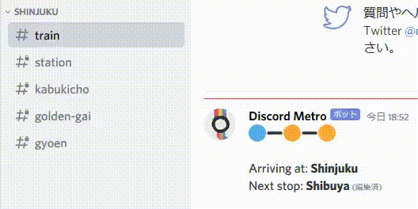

# Discord Metro

Discord Metro is an experimental interaction framework for a Discord guild that emulates a city with a metro system.

Status:
 - You can configure stations and trains, and have the trains go around the stations. There's a cool map that shows up when you do.
 - Role assignments for boarding/disembarking trains are done.
 - There's a logging channel.
 - There's a bunch of this that could be optimized or fleshed out, such as station messages showing boarding status maybe? And other stops along the line aside from the immediate next ones.
 - Discord client caching means my message processing is sub-optimal. It currently edits the previous message it can find, though I have to keep in mind the client assumes nothing changes between a channel going private and then public again.
 - This spams the API a ton so maybe don't use it as a permanent fixture. Also put the train timers high.
